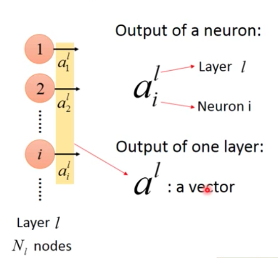
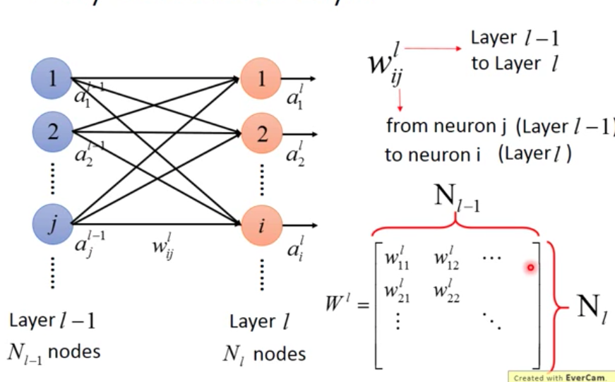

# Basic Notation

神经网络里面的参数往往很多，如果没有一套规定好的符号表示体系，那么在后面做数学推导的时候将会很糟糕，我自己的符号体系是参考李宏毅上课讲的符号体系。

### 单层Layer

通常用$a^l$来表示第$l$层的向量，用$a_i^l$来表示该层向量中的第$i$个分量。**上标表示整体，下标表示分量**。

### 参数矩阵W

这里需要注意的是，$W$中的**每一行代表的是每一个输出神经元输入的参数**。**$W$中的每一列代表的是每一个输入元输出的参数。**

