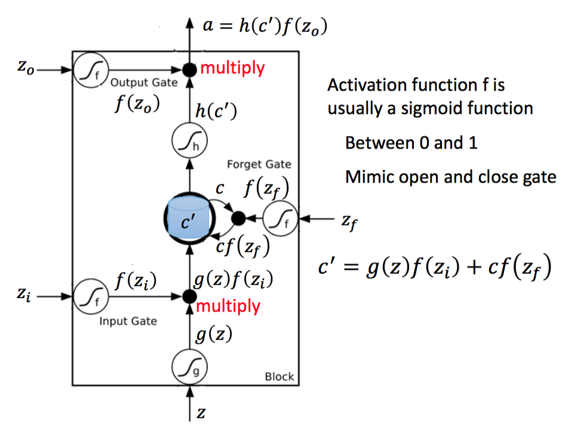

# LSTM

- **Input Gate**
  - Signal control the input gate
  - input vector
- **Forget Gate**
  - Signal control the forget gate
- **Output Gate**
  - Signal control the output gate

### 特点

- 可以解决 gradient vanishing问题，但是不能解决gradient explode问题。
  - 为什么？在RNN的模型里面，记忆中的内容都会被覆盖掉，而在LSTM中，Memory和Input是相加的，那么就说明，除非把Forget Gate关闭掉，不然这个影响不会被覆盖掉。