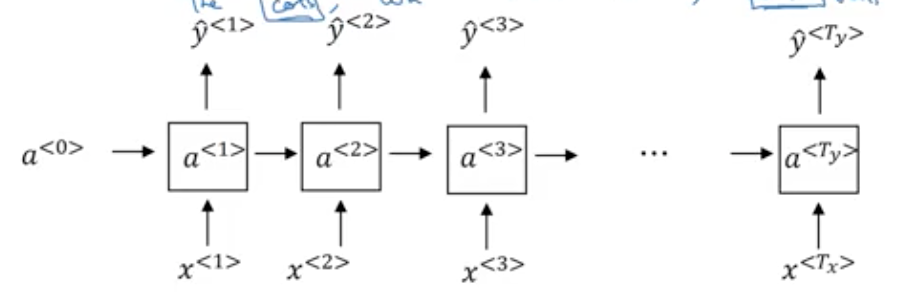

# BPTT

RNN基本的等式有：

- $s_t = tanh(Ux_t+Ws_{t-1})$
- $y_t=softmax(Vs_t)$

### 损失函数

- 交叉熵损失：$E_t(y_t, \hat{y_t}) = -y_tlog\hat{y_t}$
- 总的交叉熵损失：$E_t(y_t, \hat{y_t}) = -\sum_ty_tlog\hat{y_t}$

### 优化

利用SGD进行学习：我们需要把之前时间的所有梯度累加 $\frac{\partial E}{\partial W} = \sum_t \frac{\partial E_t}{\partial W}$

#### 梯度消失问题(The Vanishing Gradient Problem)

从上面的推导可以看出，RNN求导是需要依赖非常前面的值。

#### 梯度爆炸问题(Exploding gradients)

可以使用clipping技术。