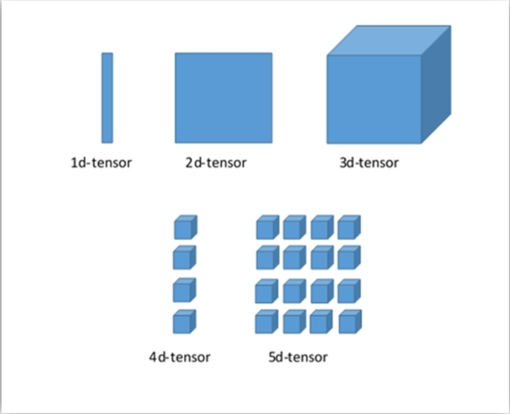

# Tensorflow

## Data Flow Graph 数据流图

### Operation

抽象的计算概念。

### Kernel

操作的具体实现，一个kernel定义了在具体设备上的具体实现。比如，add操作可以有CPU实现也可以有GPU实现。

### Session

当客户端要与TensorFlow的运行系统打交道时，必须开启一个Session。当一个Session被开启时，一个默认的图被初始化并且为空，它有两个基础方法：

- session.extend：
- session.run：运行可执行图，得到最终结果。

## Tensor 数据结构

Tensor可以由三个参数决定：

- rank：表示tensor的维度，rank为2的是矩阵，rank为1是向量；
- shape：该tensor的行数和列数；
- type：tensor里面数据元素的类型。

