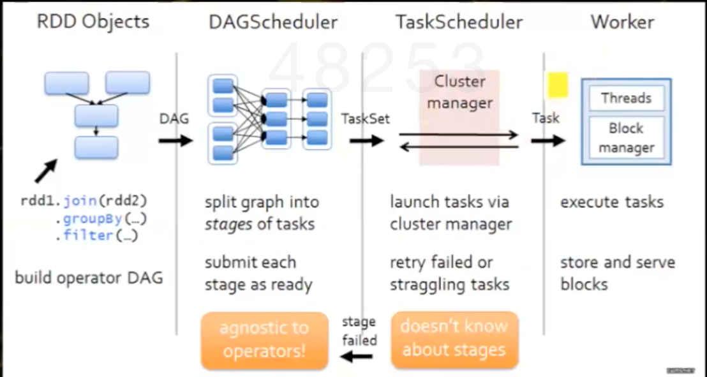

# Spark

## 基本组件

#### Spark Core

基于RDD提供了丰富的操作接口，利用DAG进行统一的任务规划，使得Spark能够更加灵活地处理类似MapReduce的批处理作业。

#### Spark SQL

兼容Hive的接口HQL，提供了比Hive高出10~100倍的查询速度的分布式SQL引擎。

#### Spark Streaming

将流失计算分解成一系列的短小的批处理作业，利用Spark轻量级和低延时的调度框架，可以很好的支持流失处理。目前已经支持的数据输入源包括Kafka、Flume、Twitter、TCP sockets。

#### GraphX

基于Spark的图计算框架，兼容Pregel和GraphLab接口，增强了图构建以及图转换功能。

#### MLib

Spark Core天然地非常适合于迭代式计算，MLlib就是构建在Spark上的机器学习算法库。目前已经可以支持常用的分类算法，聚类算法，推荐算法等。

## 运行模式

Spark应用程序的运行模式取决于传递给SparkContext的MASTER环境变量的值，个别模式还需要依赖辅助的程序接口来配合使用，目前所支持的MASTER环境变量由特定的字符串或URL组成。所有的Spark应用程序都离不开**SparkContext**和**Executor**两部分，Executor负责执行任务，运行Executor的机器称为Worker节点，SparkContext由用户程序启动，通过资源调度模块和Executor通信。

- Local 本地模式，使用N个线程。
- Spark://hostname:port  Standlone模式。
- Mesos://hostname:port 
- YARN cluster 主程序逻辑和任务都运行在YARN集群中。
- YARN client 主程序逻辑运行在本地，具体任务运行在YARN集群中。

工作流程：

- Application
- Job
- Stage
- Task

## 共享变量

在编写spark应用程序时，为了加速对一些小数据的读取，我们往往希望这些数据在所有节点上都有一份拷贝，每个任务都能从本节点的拷贝中读取数据而无需通过远程传输获取数据——通过广播变量实现。

## 数据持久化

在storage模块内部，RDD被视为由不同的block组成，对于RDD的存取是以block单位单位进行的。在Spark storage模块中存取数据的最小单位是block，所有的操作都是以block为单位进行的：

- RDD数据块：用来标识所缓存的RDD数据。
- Shuffle数据块：用来标识持久化的Shuffle数据。
- 广播变量数据块：用来标识所存储的广播变量数据。
- 任务返回结果数据块：用来标识存储在存储模块内部的任务返回结果。
- 流式数据块：Spark Streaming。

RDD上的所有运算都是基于分区的，分区是一个逻辑上的概念，数据块是物理上的数据实体。