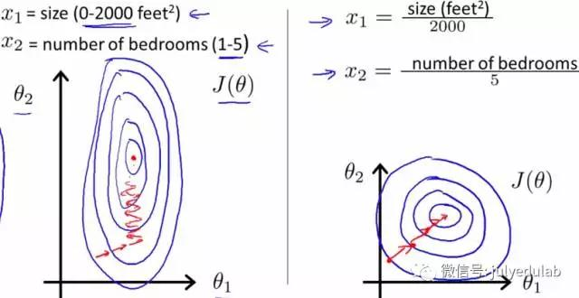
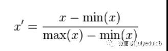
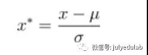

# 基本概念

# 选择题

## 1.  某超市研究销售纪录数据后发现，买啤酒的人很大概率也会购买尿布，这种属于数据挖掘的哪类问题？(A)

A. 关联规则发现 	B. 聚类 	 C. 分类 	D. 自然语言处理

## 2. **将原始数据进行集成、变换、维度规约、数值规约是在以下哪个步骤的任务？(C)**

A. 频繁模式挖掘 	B. 分类和预测 	C. 数据预处理 	D. 数据流挖掘

## 3. **下面哪种不属于数据预处理的方法？ (D)**

A变量代换	 B离散化 	C 聚集 	D 估计遗漏值 

## 4. **什么是KDD？ (A)**

A. 数据挖掘与知识发现 	B. 领域知识发现 	C. 文档知识发现 	D. 动态知识发现

## 5. **当不知道数据所带标签时，可以使用哪种技术促使带同类标签的数据与带其他标签的数据相分离？(B)**

A. 分类 	B. 聚类 	C. 关联分析 	D. 隐马尔可夫链

## 6. **建立一个模型，通过这个模型根据已知的变量值来预测其他某个变量值属于数据挖掘的哪一类任务？(C)**

A. 根据内容检索 	B. 建模描述 	C. 预测建模 	D. 寻找模式和规则

# 简答题

## 1. overfitting怎么解决？

- dropout
- regulatrization
- batch normalization

## 2. 谈谈判别式模型和生成式模型？

判别方法：由数据直接学习决策函数Y=f(X)，或者由条件分布概率P(X|Y)作为预测模型，即判别模型。
生成方法：由数据学习联合概率密度分布函数P(X,Y),然后求出条件概率分布P(Y|X)作为预测的模型，即生成模型。
由生成模型可以得到判别模型，但由判别模型得不到生成模型。
常见的判别模型有：K近邻、SVM、决策树、感知机、线性判别分析（LDA）、线性回归、传统的神经网络、逻辑斯底回归、boosting、条件随机场
常见的生成模型有：朴素贝叶斯、隐马尔科夫模型、高斯混合模型、文档主题生成模型（LDA）、限制玻尔兹曼机

## 3. L1和L2的区别？

L1范数是指向量中各个元素绝对值之和，也有个美称叫"稀疏规则算子"。

比如 向量A=[1,-1,3]，那么A的L1范数为 |1|+|-1|+|3|

L2范数是指向量中各个元素平方和的1/2次方，L2范数又称为Euclidean范数或者Frobenius范数。

简单总结如下:

- L1范数为x向量各个元素绝对值之和。
- L2范数为x向量各个元素平方和的1/2次方，L2范数又称为Euclidean范数或者Frobenius范数。
- Lp范数为x向量各个元素绝对值p次方和的1/p次方。

L1范数可以使权值稀疏，方便特征提取，L2范数可以防止过拟合，提升模型的泛化能力。

## 4. 机器学习中，为何经常对数据做归一化？

- 归一化后加快了梯度下降求最优解的速度。

  

  ​	如上图所示，蓝色的圈圈代表的是两个特征的等高线，其中左图两个特征X1和X2的区间相差非常大，X1区间是[0,2000]，X2区间是[1,5]，其所形成的登高线非常尖。当使用梯度下降法寻求最优解时，很有可能走“之字型”路线，从而导致需要迭代很多次才能收敛。而右图对两个原始特征进行了归一化，其对应的等高线显得很圆，在梯度下降进行求解时能较快的收敛。**因此如果机器学习模型使用梯度下降法求解最优解时，归一化往往非常有必要，否则很难收敛甚至不能收敛。**

- 归一化有可能提高精度。

  ​	一些分类器需要计算样本之间的距离（如欧式距离），例如KNN。如果一个特征值域范围非常大，那么距离计算就主要取决于这个特征，从而与实际情况相悖。

知道了归一化的好处后，那么我如何进行归一化呢？我们现在介绍一下，归一化的类型：

- 线性归一化

​		这种归一化方法比较适用在数值比较集中的情况。这种方法有个缺陷，如果max和min不稳定，很容易使得归一化结果不稳定，使得后续使用效果也不稳定。实际使用中可以用经验常量值来替代max和min。

- 标准差标准化

​		经过处理的数据符合标准正态分布，即均值为0，标准差为1，其转化函数如上图所示。

- 非线性归一化

  ​	经常用在数据分化比较大的场景，有些数值很大，有些很小。通过一些数学函数，将原始值进行映射。该方法包括log、指数、正切等。需要根据数据分布的情况，决定非线性函数的曲线，比如log(V,2)还是log(V,10)等。

## 5. 请简要说说一个完整机器学习项目的流程？

1. 抽象成数学问题

   明确问题是进行机器学习的第一步，机器学习的训练过程通常是一件非常耗时的事情，胡乱尝试时间成本是非常高的，这里的抽象成数学问题，指的我们明确我们可以获得什么样的数据，目标是一个分类还是回归或者是聚类的问题。

2. 获取数据

   数据决定了机器学习结果的上限，而算法只是尽可能逼近这个上限。数据要有代表性，否则必然会过拟合。而且对于分类问题，数据偏斜不能过于严重，不同类别的数据数量不要有数个数量级的差距。而且还要对数据的量级有个评估，多少个样本，多少个特征，可以估算出其对内存的消耗程度，判断训练过程中内存是否能够放得下。如果放不下就得考虑改进算法或者使用一些降维的技巧了。如果数据量实在太大，那就要考虑分布式了。

3. 特征预处理与特征选择

   良好的数据要能够提取出良好的特征才能真正发挥效力。特征预处理、数据清洗是很关键的步骤，往往能够使得算法的效果和性能得到显著提高。归一化、离散化、因子化、缺失值处理、去除共线性等，数据挖掘过程中很多时间就花在它们上面。这些工作简单可复制，收益稳定可预期，是机器学习的基础必备步骤。

   筛选出显著特征、摒弃非显著特征，需要机器学习工程师反复理解业务。这对很多结果有决定性的影响。特征选择好了，非常简单的算法也能得出良好、稳定的结果。这需要运用特征有效性分析的相关技术，如相关系数，卡方检验、平均互信息、条件熵、后验概率、逻辑回归权重等方法。

4. 训练模型与调优

   知道这一步采用到我们上面说的算法进行训练，现在很多算法都能够封装成黑盒供人使用。但是真正考验水平的是调整这些算法的超参数，使得结果变得更加优良。这需要我们对算法的原理有深入的理解。理解越深入，就越能发现问题的症结，提出良好的调优方案。

5. 模型诊断

   如何确定模型调优的方向与思路呢？这就需要对模型进行诊断的技术。过拟合、欠拟合 判断是模型诊断中非常重要的一步。常见的方法如交叉验证，绘制学习曲线等。过拟合的基本调优思路是增加数据量，降低模型复杂度。欠拟合的基本调优思路是提高特征数量和质量，增加模型复杂度。

   误差分析也是机器学习非常重要的步骤。通过观察误差样本，全面分析误差产生误差的原因：是参数的问题还是算法选择的问题，是特征的问题还是数据本身的问题。诊断后的模型需要进行调优，调优后的新模型需要重新进行诊断，这是一个反复迭代不断逼近的过程，需要不断的尝试，从而达到最优状态。

6. 模型融合

   一般来说，模型融合后都能使得效果有一定提升。工程上，主要提升算法准确度的方法是分别在模型的前端（特征清晰和预处理，不同的采样模式）与后端（模型融合）上下功夫。因为它们比较标准可复制，效果比较稳定。而直接调参的工作不会很多，毕竟大量数据训练起来太慢了，而且效果难以保证。

7. 上线运行

   这一部分内容主要跟工程实现的相关性比较大。工程是结果导向，模型在线上运行效果直接决定模型的成败。不单纯包括其准确程度、误差等情况，还包括其运行的速度，资源消耗程度，稳定性。

## 6. 简单说下有监督学习和无监督学习的区别？

- 有监督学习

  对具有标记的训练样本进行学习，以尽可能对训练样本集外的数据进行分类预测。

- 无监督学习

  对未标记的样本进行训练学习，以发现这些样本中的结构知识。

## 7. 了解正则化么？

正则化是针对过拟合而提出的，以为在求解模型最优化的是一般优化最小的经验风险，现在在该经验风险上加入模型复杂度这一项（正则化项是模型 参数向量的范数），并使用一个rate比率来权衡模型复杂度与以往经验风险的权重，如果模型复杂度越高，结构化的经验风险会越大，现在的目标就变为了结构经验风险的最优化，可以防止模型训练过度复杂，有效的降低过拟合的风险。

奥卡姆剃刀原理，能够很好的解释已知数据并且十分简单才是最好的模型。

## 8. 哪些机器学习不需要做归一化处理？

概率模型不需要归一化，因为它们不关心变量的值，而是关心变量的分布和变量之间的条件概率，如决策树、rf。而像adaboost、gbdt、xgboost、svm、lr、KNN、Kmeans之类的最优化问题就需要归一化。

