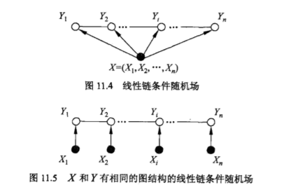

# 线性条件随机场

设$X=(X_1,X_2,…,X_n)，Y=(Y_1,Y_2,…,Y_n)$均为线性链表示的随机变量序列，若在给定随机变量序列$X$的条件下，随机变量序列$Y$的条件概率分布$P(Y|X)$构成条件随机场，即满足马尔科夫性：$P(Y_i|X,Y_1,…,Y_{i-1},Y_{i+1},…,Y_n)=P(Y_i|X,Y_{i-1},Y_{i+1})$，i=1,2,…,n

则称$P(Y|X)$为线性链条件随机场。