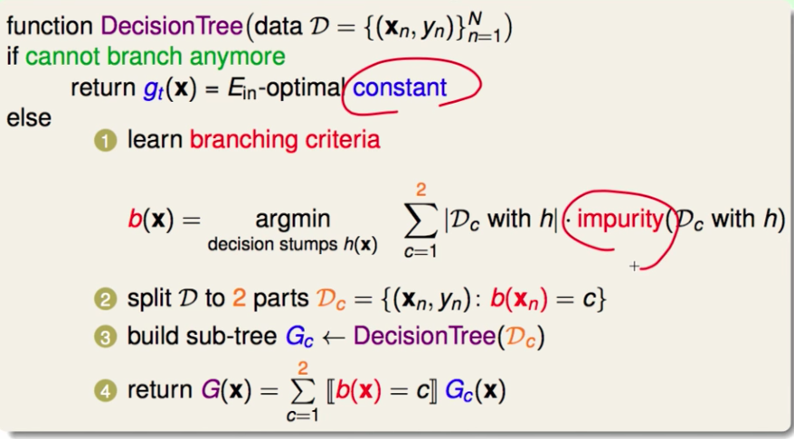

# 分类回归树

- **取值方式：（叶子回传一个常数）**
  - **分类**：取叶结点中**类别最多**的类为结果；
  - **回归**：**平均值**；
- **划分标准**：
  - **分类**：$impurity(D) = \frac{1}{N}\sum_{n=1}^N[y_n\neq y_*]$ （**统计不同的数目**），但是我们更喜欢用**Gini指数**: $1-\sum_{k=1}^K(\frac{\sum_{n=1}^N[y_n = k]}{N})^2$(代表不纯度)
  - **回归**：$impurity(D) = \frac{1}{N}\sum_{n=1}^N(y_n - \bar{y})^2$ 
- **每次分成两部分，二叉树**
- **停止条件**：
  - y都一样，不纯度为0
  - x都一样（没法切）
- 能够处理类别和数值的特征：
  - 类别：{属于该类别} {不属于该类别}
  - 数值：{小于该切分值}{大于该切分值}
- 寻找替代的特征（可以处理缺失特征）

#### 整个算法流程

#### 正则化-剪枝

我们希望去平衡误差和模型复杂度之间的关系 : $argmin_{all possible G} E_{in}(G) + \lambda \Omega (G)$

但是我们不可能枚举所有可能的树，我们基本做法是在完全长成的树上做修改，具体如下：

- 对于叶子节点，假设有10个，我们尝试依次去掉第1,2,3,…,10个，然后求 $G^{(i)} = argmin_GE_{in}(G)$ 其中，$G^{(i)}$表示从$G^{(i-1)}$摘掉一个叶子节点。基本迭代如下：

  - 一开始是完全长成的树
  - 求摘掉一个叶子的树中，哪个是最优的
  - 在摘掉一个叶子的基础上，求再摘掉一个叶子的树种，哪个是最优的
  - ….

- 以上的步骤会产生非常多的树，我们对这些树做选择，选择标准为 ： $argmin_{all possible G} E_{in}(G) + \lambda \Omega (G)$

  ​

#### 优点

- 可解释性强
- 可处理多类别分类
- 可处理类别变量
- 可处理特征值缺失
- 可用于非线性训练

