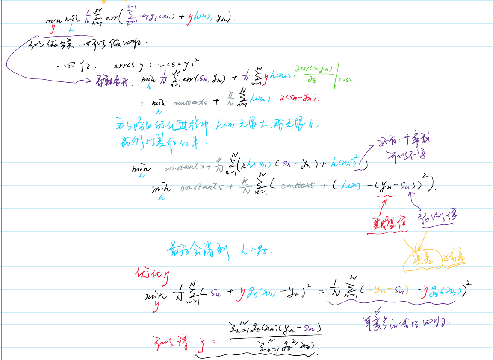

# GBDT

基于Adaboost-DTree，我们先看一下AdaBoost-DTree的损失函数:

$min_{\eta} min_h \frac{1}{N}\sum_{n=1}^{N}exp(-y_n(\sum_{\tau=1}^{t-1}\alpha_\tau g_\tau (x_n) + \eta h(x_n)))$

然后，我们想， 我们可不可以修改损失函数，得到另外一个模型呢？答案是可以的，我们定义损失函数为：

$min_{\eta} min_h \frac{1}{N}\sum_{n=1}^{N}err(\sum_{\tau=1}^{t-1}\alpha_\tau g_\tau (x_n) + \eta h(x_n), y_n)$

对于不同的任务，我们可以设定不同的损失函数：

### 回归任务

