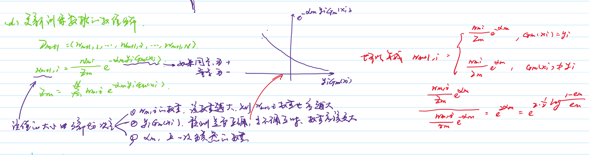
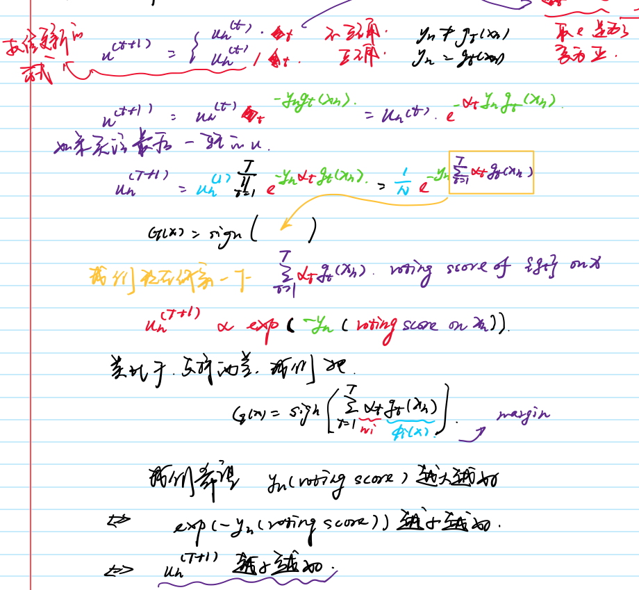
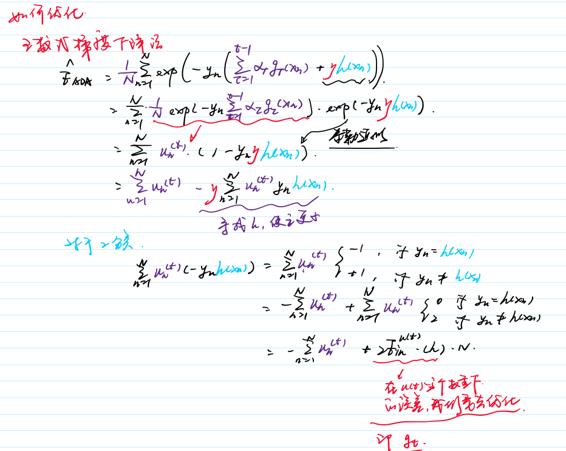
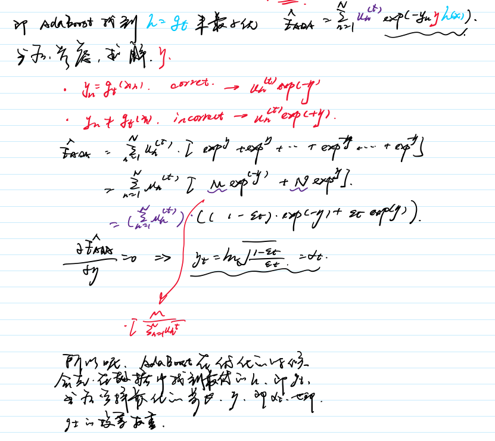

# AdaBoost

对于分类问题而言，给定一个训练样本集，求比较粗糙的分类规则（弱分类器）要比求精确的分类规则（强分类器）容易得多。提升方式就是从弱学习算法出发，反复学习，得到一系列弱分类器，然后组合这些弱分类器，构成一个强分类器。

两个基本问题：

1. 每一轮如何改变训练数据的权值或概率分布；
2. 如何将弱分类器组合成一个强分类器；

## 三个基本步骤

### 1. 初始化训练数据集

### 2. 学习、获得系数、更新权值

### 3. 组合成强分类器

- 需要注意的的是，每个弱分类器都是该轮样本中最优的分类器。
- 可以认为AdaBoost算法是模型为加法模型、损失函数为指数函数、学习算法为前向分步算法

## 数学推导

### 损失函数

从上面的推导来看，Adaboost最后会使得样本的权重越来越小，所以，我们可以把所有样本的权重和当做是损失函数。

损失函数为：

$min_{\eta} min_h \frac{1}{N}\sum_{n=1}^{N}exp(-y_n(\sum_{\tau=1}^{t-1}\alpha_\tau g_\tau (x_n) + \eta h(x_n)))$

从上面推导来看，AdaBoost这个算法非常的有趣，它的优化过程就是要找每一个步中最优的模型，而该模型对应的步长成了投票时的权值。

## AdaBoost Decision Tree

将决策树用作AdaBoost算法的基模型中，我们知道AdaBoost算法是根据改变样本权重来获得不同的，对于决策树，我们怎么让它感知到样本的权重呢？我们的做法不是去修改模型，而是去修改采样的方式，我们让权重更多大的样本被采样的的机会更多。

还需要考虑一个问题，如果我们让决策树无限生长，那么它在训练数据上的错误率会很低，导致它的投票权很大，我们应该避免这样的情况出现，所以我们要及早剪枝，一种更常用的方法是限制树的高度。