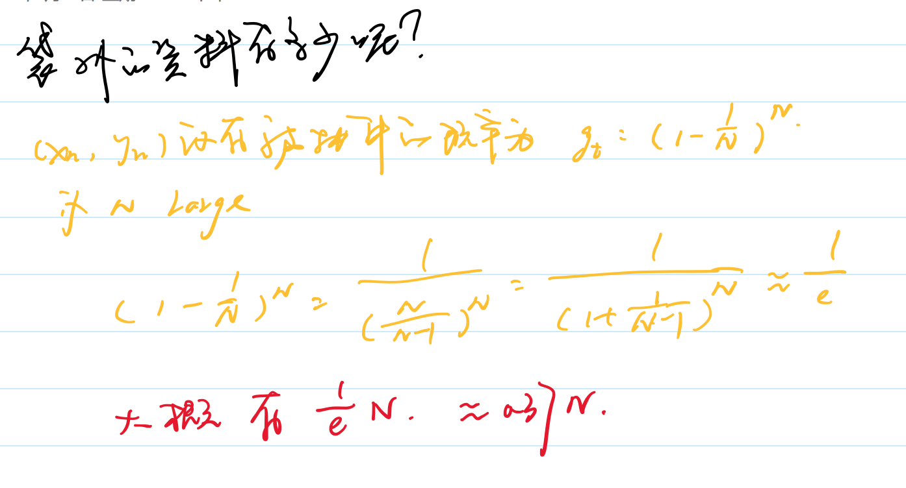
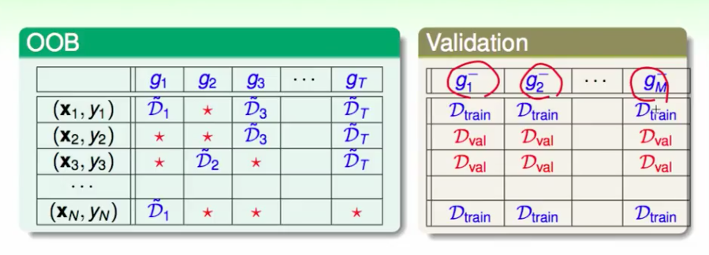

# Bagging

Bagging更加强调产生模型的方式。和Blending的目的是一样的。但是Blending是假设模型都有了，怎么去组合这些模型，而Bagging强调的是怎么去得到不同的基模型。

我们要得到不同的模型，我们通常有两种思路，一种就是用同一套模型，但是训练数据不一样，另外一种就是用不一样的模型。对于前者，我们需要考虑如何用已有的训练数据，产生出不一样的样本呢？一般都是采用`Bootstrap`的方式：先抓一个，记录下来，放回去，摇一摇，在抓一个…（注意这种抓取方式可能使得同一笔资料被抓取多次）。

通过根据训练子集获取方式的不同，可以分为以下几类：

- 随机取样——Pasting
- **有放回取样（Bootstrap）——Bagging** 这种采样方式，有$N!/N^N$种几率从N个样本抽取出来的样本和原来样本一样。
- 特征子集——Random Subspaces
- 样本和特征都是子集——Random Patches

所有选取样本子集的时候有两个方面要考虑，是否选取特征，是否为有放回选取。

在取样的时候，我们有时候拿袋外的样本当做测试样本。

那么这个袋外的资料有多少呢：

**是否可以用来做验证集？**

是的，但是要记住，在模型融合中，我们要的不是单个模型的最优，而是所有模型融合后的最优，所以我们希望用这些袋外数据来对G做验证集，具体如下:

对于$(x_i, y_i)$然后来交叉验证$G_{N}^-(x) = average(g_i, g_j, …, g_t)$，其中，这些g是单个模型，而且$(x_i, y_i)$对于这些模型是袋外。最后求总的验证误差 ： $E_{oob}(G) = \frac{1}{N}\sum_{n=1}^Nerr(y_n, G^-_n(x_n))$

