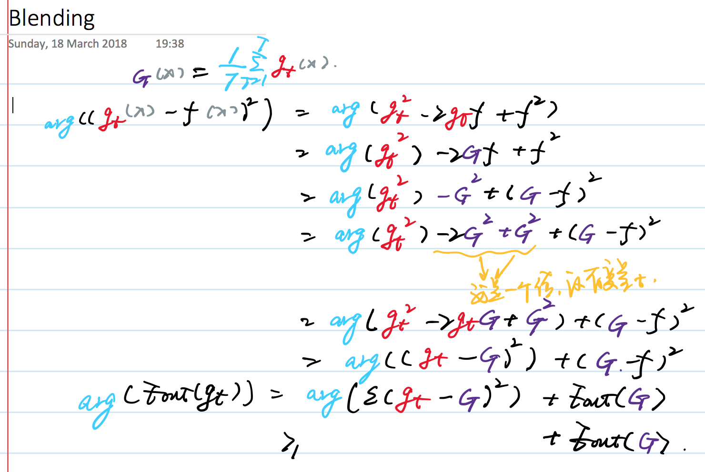

## Uniform Blending(Voting)

这种方式有称为投票的方式，我们给每个模型的权重是一样的，都是1票：

- 对于二分类问题 $G(x) = sign(\sum_{t=1}^Tg_t(x))$，对于多分类问题 $G(x) = argmax_{1<=k<=K}\sum_{t=1}^T[g_t(x) = k]$
- 对于回归问题，我们对所有结果相加然后求平均：$G(x) = \frac{1}{T} \sum_{t=1}^T g_t(x)$

### 数学推导证明有效性

我们可以认为右边的第一项为variance，第二项为bias，我们希望通过降低variance的方式来是的模型的误差变小。

## Linear Blending

上面讨论的是均匀组合，但是，有时候我们需要给不同的模型以不同的权值。

即，$G(x) = sign(\sum_{t=1}^T \alpha_t g_t(x)) with \alpha_t >= 0 $

这时候我们需要通过计算，求得是的$E_{in}$最小的$\alpha$，如果选择损失函数为均方损失函数，我们就可以得到如下的表达式：$min_{\alpha_t >= 0} \frac{1}{N}\sum_{n=1}^N(y_n - \sum_{t=1}^T \alpha_t g_t(x_x))^2$

实践中，我们的做法都是，先在训练数据上选出最佳的单个模型，然后在验证集上进行权值的选择。

## Any Blending(Stacking)

我们可以不用线性组合的方式，而是进行其他的组合方式，这样的方式的另一个名称叫做Stacking。

## 实践

假设我们现在手头上有很多的模型，需要对这些模型进行组合，Blending就是其中的一种方式。通过根据训练子集获取方式的不同，可以分为以下几类：

- 随机取样——Pasting
- 有放回取样——Bagging
- 特征子集——Random Subspaces
- 样本和特征都是子集——Random Patches

所有选取样本子集的时候有两个方面要考虑，是否选取特征，是否为有放回选取。

在取样的时候，我们有时候拿袋外的样本当做测试样本。