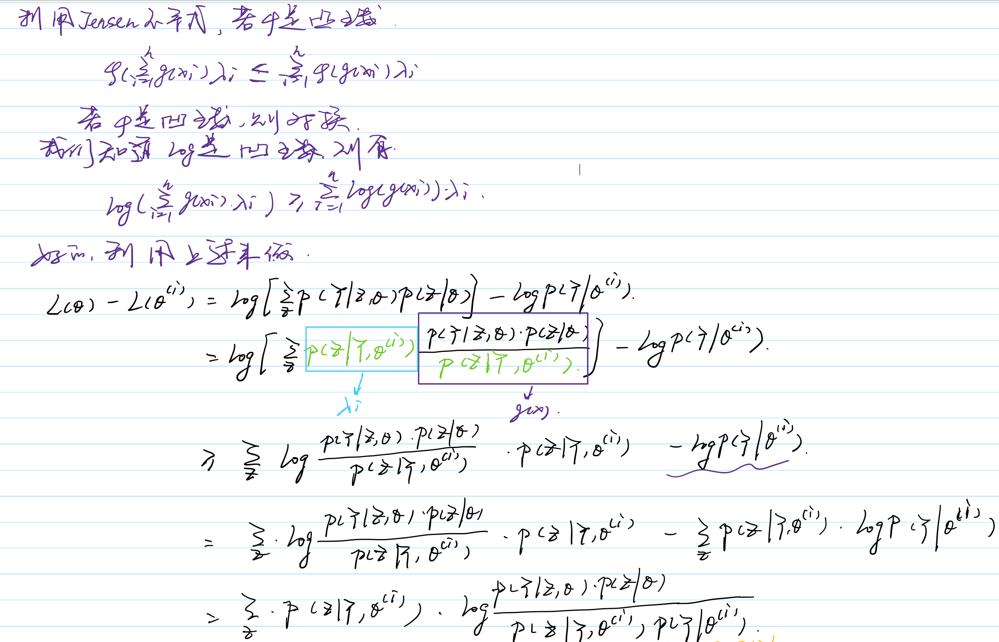

# EM

- 初始值的选择对EM来说非常重要。

### 例子

### 算法流程

输入：观测变量数据Y，隐变量数据Z，联合分布$P(Y,Z|\theta)$，条件分布$P(Z|Y,\theta)$

输出：模型参数$\theta$

（1）选择参数的初始值$\theta^0$，开始迭代

（2）**E步**：记$\theta^{(i)}$为第i次迭代参数$\theta$的估计值，在第i+1次迭代的E步，计算

$Q(\theta,\theta^{(i)})=E_z[logP(Y,Z|\theta)|Y,\theta^{(i)}] = \sum_zlogP(Y,Z|\theta)P(Z|Y,\theta^{(i)})$

（3）**M步**：求使$Q(\theta,\theta^{(i)})$极大化的$\theta$，确定第i+1次迭代的参数的估计值$\theta^{(i+1)}$

$\theta^{(i+1)} = argmax_{\theta}Q(\theta,\theta^{(i)})$

（4）重复第（2）步和第（3）步，直到收敛

### Q函数

完全数据的对数似然函数$logP(Y,Z|\theta)$关于在给定观测数据Y和当前参数$\theta^{(i)}$下对未观测数据Z的条件概率分布$P(Z|Y,\theta^{(i)})$的期望：

$Q(\theta,\theta^{(i)})=E_z[logP(Y,Z|\theta)|Y,\theta^{(i)}] = \sum_zlogP(Y,Z|\theta)P(Z|Y,\theta^{(i)})$

### 收敛性

