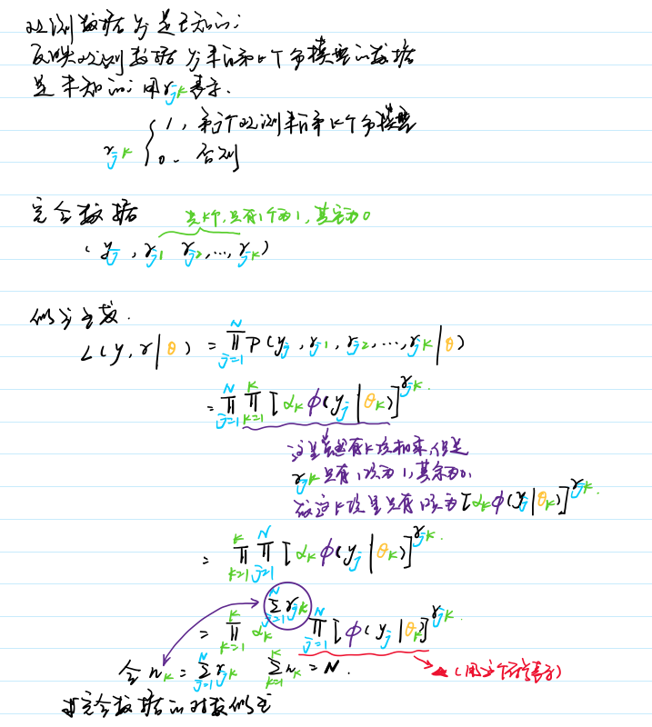
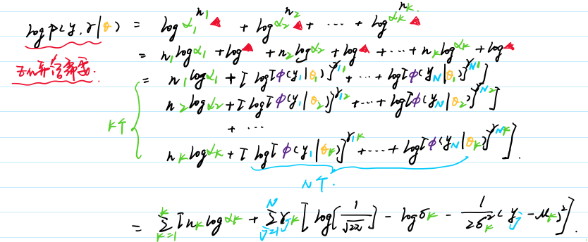
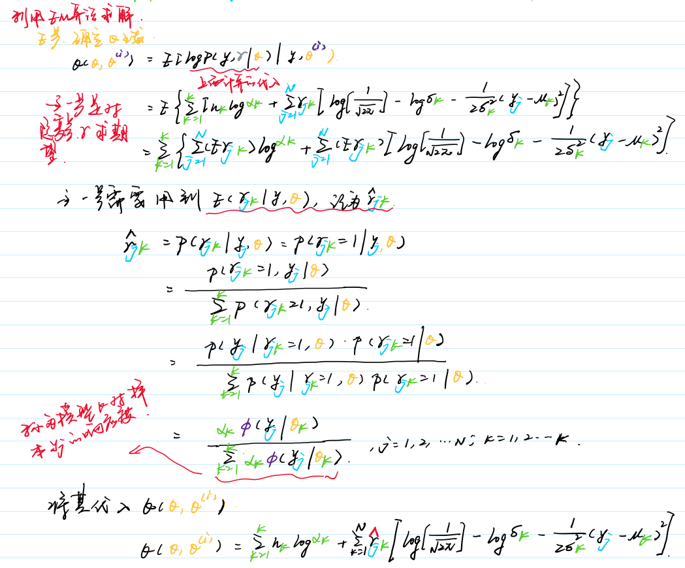
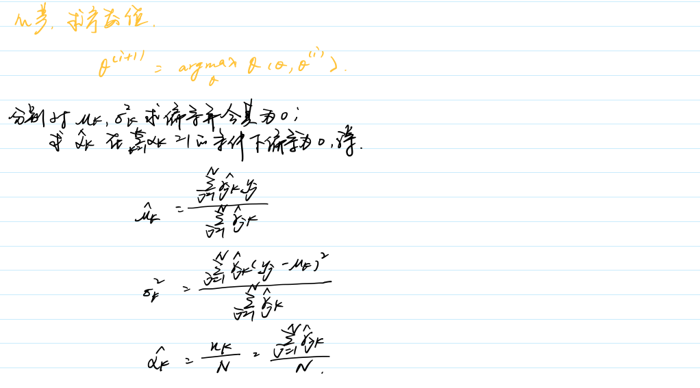
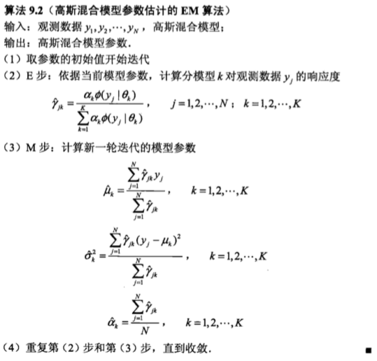

# 高斯混合模型

### 模型定义

高斯混合模型是指具有如下形式的概率分布模型：$P(y|\theta) = \sum_{k=1}^K\alpha_k \varphi(y|\theta_k)$， 这个公式代表的意思是说，样本y由k个高斯分布产生的概率为，每个高斯分布的权重$\alpha_k$与对应高斯分布产生y的概率的乘积和。其中，$\varphi(y|\theta_k) = \frac{1}{\sqrt{2\pi}\sigma_k}exp(-\frac{(y-\mu_k)^2}{2\sigma_k^2})$是高斯分布密度函数，其中$k$代表第k个分模型。

一般混合模型可以由任意概率分布密度代替高斯分布密度，其中高斯混合模型是最常用的。

### 特性

- **优点**
  - 高斯混合模型是最快的混合模型算法。
  - 由于它极大化似然函数，所有不会偏向于特殊的模型结构。
- **缺点**
  - 奇异值
  - 多少个组件合适

### EM算法估计模型参数

### 算法

