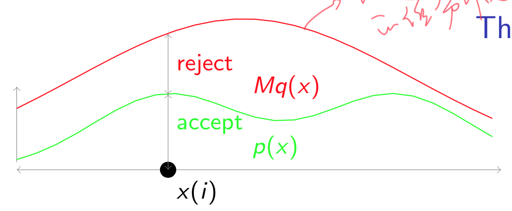

# Inference

机器学习中，很多时候我们只是需要找到最佳的参数即可。但是，在有些场景下， 我们需要整个后验概率的分布：$p(\theta |Data)\propto p(data|\theta)p(\theta)$.

在这个问题中，我们用先验、似然得到的后验表达式过于复杂，我们找不出该后验分布任何的特征。我们可以通过采样的方式来逼近这些特性值。

## 共轭

先验和后验在该似然下是同一种分布。

## Inverse of CDF

### 具体步骤

1. 先在`0~1`之间做均匀采样，得到$u$。$u\sim U(0,1)$。
2. $x=cdf^{-1}(u)$

### 特点

- 需要求解出$cdf^{-1}$，但是有些函数是求解不出来的。
- 该方法不适用于所有情形。

## Rejection Sampling

我们对红色的分布乘上一个常数，使得它在任意的点上都比绿色的分布的值高。

### 具体步骤

1. 先从红色分布中采样一个样本点。
2. 在该样本点对应的值上，用均匀分布采样一个值，然后决定是否被拒绝。

### 特点

- 效率太低；

## Adaptive Rejection Sampling

### 特点

- $logp(x)$是凹函数才能用；

## Importance Sampling

$E_{p(x)}(f(x))=\int_{x}f(x)p(x)dx$，如果$p(x)$能够很好的采样（必须近可能的按照该分布去做采样），我们就可以估计$\hat{E_{p(x)}}[f(x)]=\frac{1}{N}\sum_{i=1}^{N}f(x^{(i)})$，但是当$p(x)$不能够很好地采样。我们就可以对式子进行变形：

$E_{p(x)}[f(z)]=\int f(z)\frac{p(z)}{q(z)}q(z)dz\approx \frac{1}{N}\sum_{n=1}^Nf(z^i)\frac{p(z^i)}{q(z^i)}$

