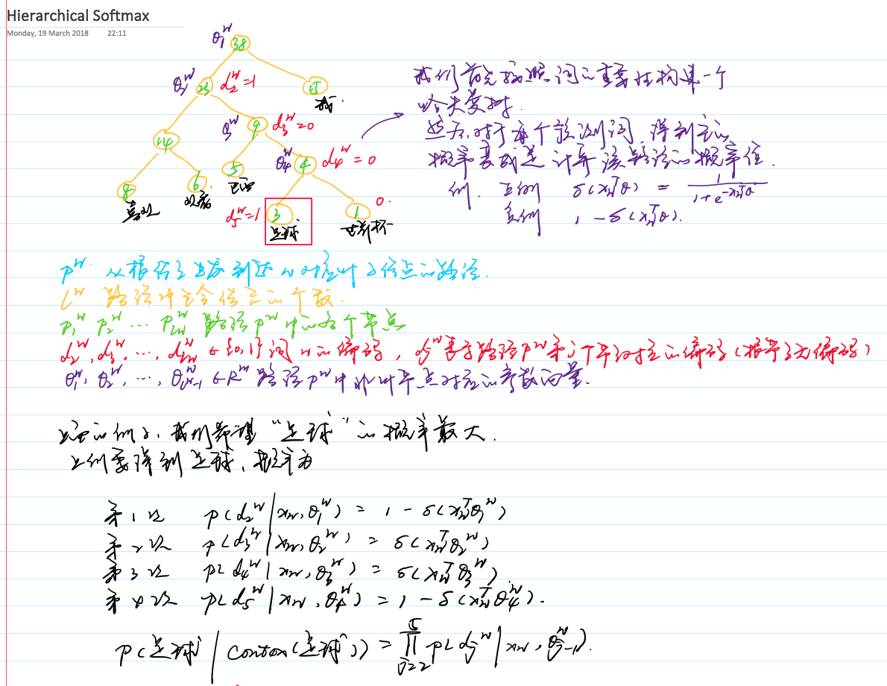
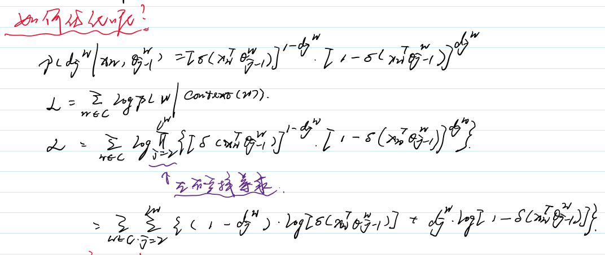

# Word2Vec

`word2vec`是一类神经网络模型，对于无标记的训练预料，可以为每个词产生一个包含语义信息的词向量。

- 我们可以比较不同词之间的语义相似度，通过计算对应的词向量的`cosin`距离。
- 我们把可以词向量当做特征，用于不同的有监督学习的NLP任务中，如文档分类、命名体识别和语义分析。

## Skip-Gram Model

### 例子

我们尝试去预测该词周边的词，预测多少个周边的词有窗口大小决定。

### 网络结构

### 损失函数

### 优化器

## The Continuous Bag-of-Words Model

### 网络结构

### 损失函数

### 优化

## Hierarchical Softmax

该方法不用为了获得概率分布而评估神经网络中的W个输出结点，而只需要评估大约$log_2(W)$个结点。**层次Softmax**使用一种二叉树结构来表示词典里的所有词，V个词都是二叉树的叶子结点，而这棵树一共有V−1个非叶子结点。

我们可以定义损失函数，实际上就是逻辑回归中的极大似然函数：

我们用梯度上升法求解：

## 负采样

## 分析

- skip-gram速度比较慢，但是对不平凡词效果比较好
- CBOW比较快
- 层次softmax对不平凡词效果比较好，负采样对平凡词效果比较好，对低维度向量效果比较好。
- 对平凡词进行采样可以提高大数据集的正确率和速度。
- 词向量的维度通常来说，越高越好。
- 窗口大小，skip-gram一般设置为10，CBOW设置为5。