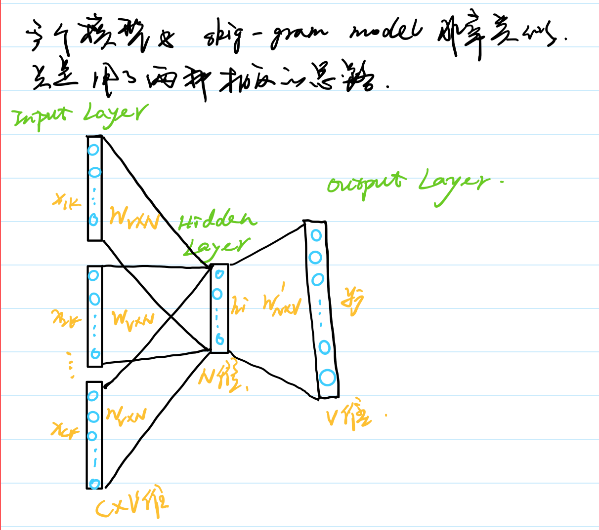
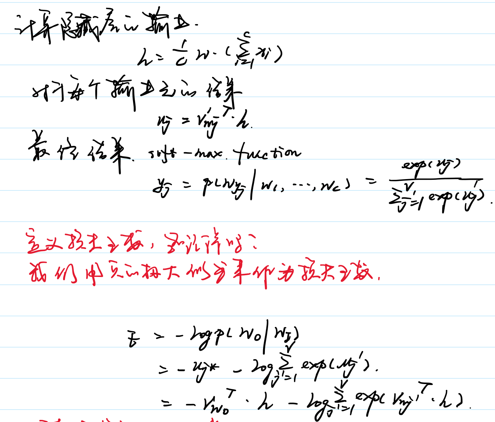

# Word2Vec

`word2vec`是一类神经网络模型，对于无标记的训练预料，可以为每个词产生一个包含语义信息的词向量。

- 我们可以比较不同词之间的语义相似度，通过计算对应的词向量的`cosin`距离。
- 我们把可以词向量当做特征，用于不同的有监督学习的NLP任务中，如文档分类、命名体识别和语义分析。

## Skip-Gram Model

### 例子

我们尝试去预测该词周边的词，预测多少个周边的词有窗口大小决定。

### 网络结构

### 损失函数

### 优化器

## The Continuous Bag-of-Words Model

### 网络结构

### 损失函数

### 优化

