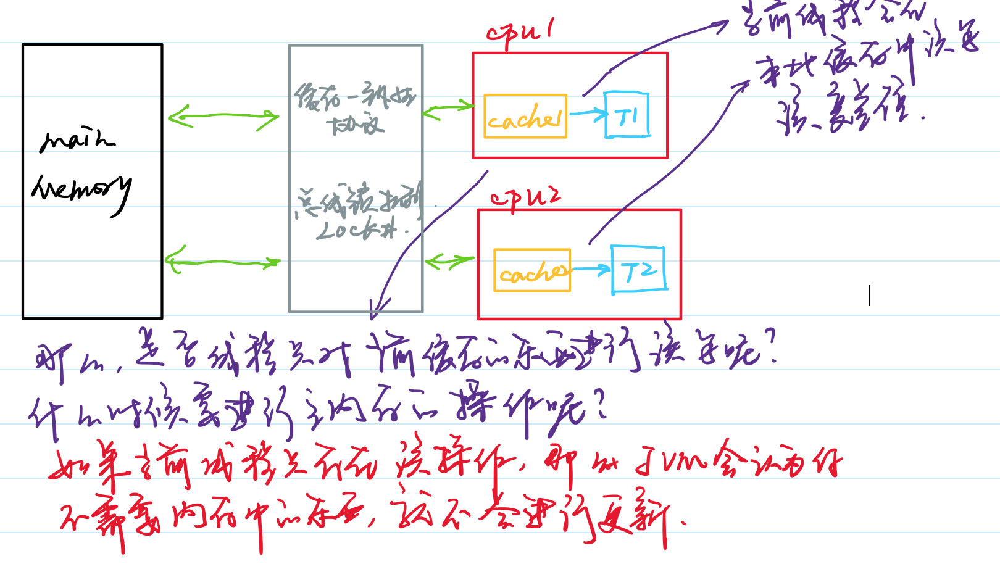

## Volatile

- **volatile**：Java编程语言允许线程访问共享变量，为了确保变量能够准确和一致地更新，线程应该确保通过排他锁单独获得这个变量。将当前处理器缓存行的数据写回到系统内存。**这个写回内存的操作会使在其他CPU里缓存了该内存地址的数据无效**。
  - volatile变量不会被缓存在寄存器或者其他处理器不可见的地方，因此在读取volatile类型的变量时总会返回**最新**写入的值。
  - 在访问volatile变量时不会执行加锁操作，但是我们可以把它的行为想成加锁的get和set方法。
  - **加锁机制既可以确保可见性又可以确保原子性，而volatile变量只能确保可见性**。
  - 使用条件：
    - 对变量的写入操作不依赖变量的当前值，或者你能确保只有单个线程更新变量的值。
    - 该变量不会与其他状态变量一起纳入不变性条件中。
    - 在访问变量时不需要加锁。
  - 典型用法：
    - 检查某个状态标记以判断是否退出循环。
- CPU引入cache解决了速度问题，但是又引入了缓存不一致的问题。当CPU在操作的时候，会先在缓存中进行操作，然后将缓存中的内容刷新到CPU中。
  ​          **main memory -> cache （进行操作 如 i++）-> cache -> main memory**
  ​          **main memory -> cache （进行操作如 i++）-> cache -> main memory**

- 解决缓存不一致的方法如下：

- - 给数据总线加锁：当第一个线程访问主内存的时候就对这块内存区域加锁，在线程操作完并写回主内存之前，其他的线程都不可以读取这块主内存的内容。（效率低下）

  - CPU高速缓存一致性协议：Intel MESI，核心思想如下：

  - - 当cpu写入数据的时候，如果发现该变量被共享（也就是说，在其他cpu也存在该变量的副本），会发出一个信号，通知其他cpu该变量的缓存无效。
    - 当其他线程访问该变量，重新到内存中读取该变量。

结合Java内存模型分析图如下:

volatile关键字可以理解为就是缓存一致性协议。保证各个线程中的缓存内容是一致的。